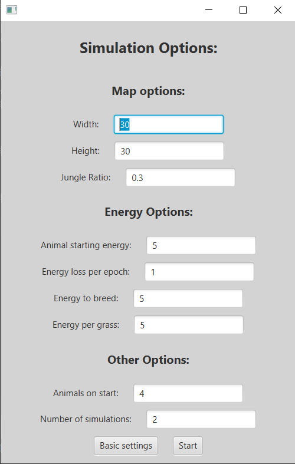
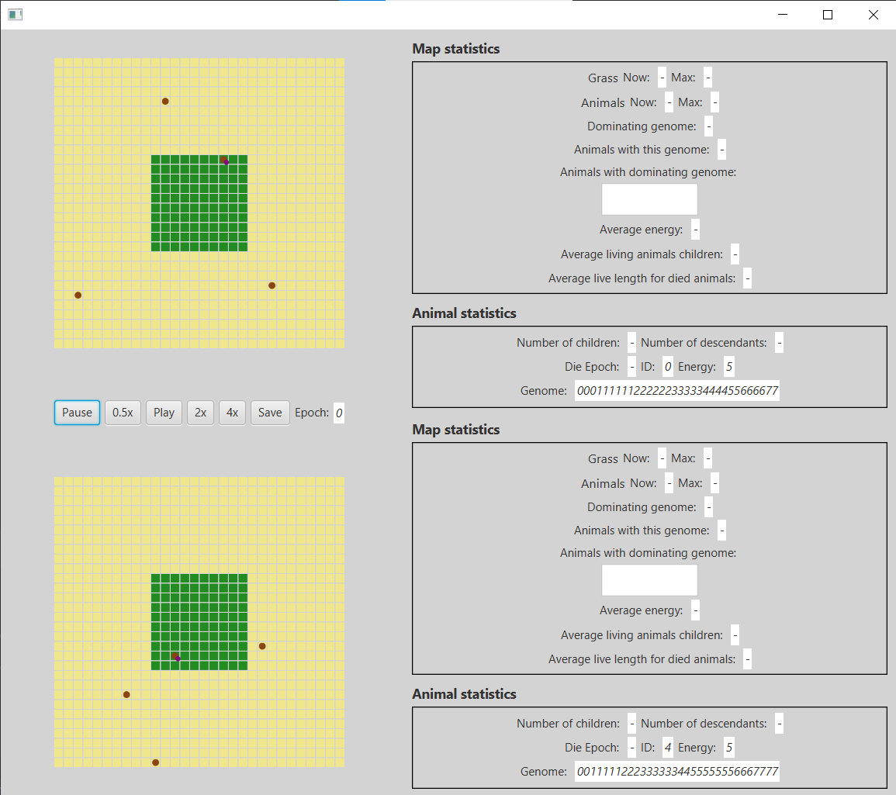

# EvolutionarySimulator

Application is simple simulation of simulation based on:   
https://github.com/apohllo/obiektowe-lab/tree/master/proj1  
made for Objective Programming Course. 

Applications consist of two stages:
- settings selections
- simulation

## Settings selections

User can choose settings for simulation such map size, animals energy use or
number of animals and grass, it is possible to save these settings.

## Simulation

On the screen we see current position of animals and grass when it is grown. Between maps are buttons to control simulations speed.
In the right there are statistics about map and about selected animals (you can select the animal clicking on it).